<div align="center">

<a href="https://drishmalhotra.vercel.app/">
  
</a>

<a href="https://github.com/cyberdrish">
  
</a>

<p>
  <a href="https://www.chitkara.edu.in/"></a>
  <a href="https://www.chitkara.edu.in/"></a>
  <a href="https://www.chitkara.edu.in/"></a>
  <a href="https://www.google.com/maps/search/?api=1&amp;query=Noida%2C%20India"></a>
</p>

<p>
  <a href="https://drishmalhotra.vercel.app/"></a>
  <a href="https://www.linkedin.com/in/drish-malhotra/"></a>
  <a href="mailto:drishmalhotra1997@gmail.com"></a>
  <a href="https://github.com/cyberdrish"></a>
</p>

<p>
  <a href="https://github.com/cyberdrish"></a>
  <a href="https://github.com/cyberdrish?tab=followers"></a>
  <a href="https://github.com/cyberdrish?tab=repositories"></a>
</p>

</div>

---

## About Me

I'm **Drish Malhotra**, a **Senior Frontend Engineer with 5+ years of experience** building enterprise SaaS products, operational dashboards, and real-time energy-trading interfaces. I specialize in **React, TypeScript, Next.js, and frontend architecture**, with a focus on software that stays responsive, accessible, and maintainable as product requirements grow.

My work spans reusable component systems, application state, API integration, performance optimization, automated testing, and release delivery. I've delivered **20% improvements in dashboard rendering and page-load performance**, reduced legacy UI maintenance effort by **25%**, and helped teams move from **bi-monthly to weekly releases** through Azure CI/CD.

I bring a **product engineering mindset** to implementation: understand the workflow, choose clear abstractions, validate behavior, and connect technical decisions to user and business outcomes. My full-stack work connects React interfaces with **REST, GraphQL, Supabase, Firebase, and relational data**, supported by foundational **C# and ASP.NET** experience.

Alongside frontend engineering, I apply **AI-assisted development tools** to coding workflows and continue developing my **AI/ML foundations** through technical training. My current AI experience centers on developer productivity and foundational learning.

**Open To**

- Senior Frontend Engineer and React / TypeScript engineering opportunities.
- Product engineering roles involving SaaS, dashboards, and complex user workflows.
- Collaboration on accessible interfaces, component libraries, and frontend tooling.
- Open-source contributions, technical knowledge sharing, and engineering mentorship.

---

## Tech Stack

### Languages

<p>
  <a href="https://skillicons.dev"></a>
</p>

**JavaScript ES6+ · TypeScript · HTML5 · CSS3 · C# fundamentals**

### Frontend

<p>
  <a href="https://skillicons.dev"></a>
</p>

**React Hooks · Redux Toolkit · Context API · TanStack Query · React Router · Design Systems · Recharts · Chart.js · WCAG Accessibility**

### Backend & Databases

<p>
  <a href="https://skillicons.dev"></a>
</p>

**REST APIs · GraphQL · JSON · Axios · Microsoft SQL · ASP.NET fundamentals · Authentication & Session Workflows**

### Cloud, DevOps & Tooling

<p>
  <a href="https://skillicons.dev"></a>
</p>

<p>
  <a href="https://skillicons.dev"></a>
</p>

**Azure DevOps · Azure Pipelines · CI/CD · React Testing Library · Playwright · TDD · ATDD · Code Reviews · Agile Delivery**

---

## AI / ML Expertise

| Domain | Proficiency | Details |
|:---|:---|:---|
| **AI-Assisted Software Development** | Applied experience | GitHub Copilot, Cursor, Claude Code, ChatGPT, and Google Gemini within engineering workflows. |
| **AI Development Practices** | Applied experience | Coaching engineers on AI-assisted development alongside maintainable components, code review, and testing quality. |
| **AI Technical Foundations** | Foundational training | Qualcomm AI Upskilling Certificate: Technical Foundations, 2026. |
| **Machine Learning** | Learning focus | Developing conceptual understanding of ML systems and their application in software products. |
| **AI-Enabled Product Interfaces** | Exploration | Exploring how React and TypeScript interfaces can make AI capabilities useful within everyday product workflows. |

---

## Featured Projects

<details open>
<summary><strong>Hotel Booking Website · Guest Reservations & Account Workflows</strong></summary>

<br />

A hotel booking application that connects accommodation discovery, availability, reservations, and guest account management in a responsive web experience.

| Dimension | Engineering Details |
|:---|:---|
| **Stack** | Next.js 15 · React 19 · JavaScript · Tailwind CSS · Supabase · NextAuth · React DayPicker |
| **Scale** | Guest-facing portfolio application covering accommodation browsing, date selection, reservations, and profile management. |
| **Performance** | Next.js application architecture with targeted path revalidation after selected data mutations; public load-test benchmarks are not published. |
| **Security** | Google sign-in through NextAuth, server-side session checks, and ownership checks for reservation updates and deletions. |
| **Impact** | Demonstrates a connected booking journey with reusable UI, server actions, and database-backed guest workflows. |
| **Repository** | [View source](https://github.com/cyberdrish/hotel_bookings_website) · [Live application](https://hotel-bookings-website.vercel.app/) |

The implementation connects interface state with server-side booking operations. Authentication establishes guest identity, while reservation actions connect user input with Supabase data and route updates. The project demonstrates practical full-stack delivery around a clearly defined customer journey.

</details>

<br />

<details>
<summary><strong>Hotel Management Dashboard · Booking & Inventory Operations</strong></summary>

<br />

An administrative dashboard for managing bookings, room inventory, pricing, and operational data through modular, data-driven interfaces.

| Dimension | Engineering Details |
|:---|:---|
| **Stack** | React · JavaScript · Vite · TanStack Query · Supabase · React Router · Styled Components · Recharts · React Hook Form |
| **Scale** | Multiple administrative workflows spanning bookings, inventory, settings, authentication, and dashboard reporting. |
| **Performance** | TanStack Query supports server-state management and caching; Vite provides the application build pipeline. |
| **Security** | Authentication-aware route handling with loading states and login redirects; Supabase-backed account workflows. |
| **Impact** | Brings hospitality operations into a consistent dashboard with reusable controls, forms, and visual reporting. |
| **Repository** | [View source](https://github.com/cyberdrish/hotel_manager) · [Live application](https://hotelbookingmanager.netlify.app/) |

The project separates feature modules, service access, and shared UI to keep administrative workflows understandable. Query-driven data handling and a consistent component system support the practical demands of an operations interface.

</details>

<br />

<details>
<summary><strong>Restaurant Food Order · Menu, Cart & Checkout</strong></summary>

<br />

A food-ordering application that guides users from menu browsing to cart updates, delivery details, and order placement.

| Dimension | Engineering Details |
|:---|:---|
| **Stack** | React · JavaScript · Redux Toolkit · React Router · Tailwind CSS · Vite · REST APIs |
| **Scale** | Customer ordering workflow with cart quantities, delivery information, priority orders, and order lookup. |
| **Performance** | Redux selectors derive cart totals; route navigation state provides feedback during order submission. |
| **Security** | Client-side phone validation and required checkout fields; payment processing and backend security are outside this frontend demonstration. |
| **Impact** | Demonstrates coordinated application state, API-driven order placement, and clear checkout feedback. |
| **Repository** | [View source](https://github.com/cyberdrish/restaurant_food_order) · [Live application](https://restaurantfoodorderonline.netlify.app/) |

The implementation organizes menu, cart, user, and order concerns into feature modules. Checkout combines derived pricing, optional location-assisted address entry, validation feedback, and an API request before navigating to the created order.

</details>

<br />

<details>
<summary><strong>Drish Portfolio · Professional Experience & Project Case Studies</strong></summary>

<br />

A responsive engineering portfolio presenting professional experience, technical skills, project case studies, and contact options.

| Dimension | Engineering Details |
|:---|:---|
| **Stack** | React 19 · TypeScript · Vite · Tailwind CSS 4 · React Router · EmailJS |
| **Scale** | Personal portfolio with route-level pages, reusable sections, theme preferences, and a contact workflow. |
| **Performance** | Vite production builds and TypeScript validation; shared components support consistent implementation across pages. |
| **Security** | Public EmailJS configuration is supplied through environment variables; missing configuration produces an unavailable contact-form state. |
| **Impact** | Gives recruiters and collaborators a focused view of engineering experience and project work. |
| **Repository** | [View source](https://github.com/cyberdrish/Drish-Portfolio) · [Live application](https://drish-portfolio.vercel.app/) |

The portfolio uses reusable sections and persistent theme state to present a consistent professional identity. Its documented review process covers keyboard interaction, reduced motion, responsive navigation, and contact-form validation.

</details>

<br />

<details>
<summary><strong>React + .NET Image CRUD · Frontend & API Integration</strong></summary>

<br />

A full-stack learning project connecting a React client with an ASP.NET API for employee records and image CRUD workflows.

| Dimension | Engineering Details |
|:---|:---|
| **Stack** | React · Vite · C# · ASP.NET · HTTP APIs |
| **Scale** | Local development project demonstrating a separate frontend client and backend API. |
| **Performance** | Focused CRUD request flows; production performance benchmarks are not published. |
| **Security** | The documented development CORS configuration restricts the allowed browser origin to the local frontend. |
| **Impact** | Demonstrates hands-on integration across UI, HTTP requests, API endpoints, and image-backed records. |
| **Repository** | [View source](https://github.com/cyberdrish/React-.Net-API-with-Image-CRUD) |

This project extends frontend work into API integration and local service configuration. It provides a practical foundation for understanding how React applications communicate with independently hosted backend services.

</details>

---

## Experience

### Software Developer · TechUApps Technologies

**April 2024 – Present · Noida, India**

Build component-driven interfaces for data-heavy enterprise dashboards, with responsibility spanning architecture, API integration, rendering performance, and frontend quality.

- Architected reusable React, TypeScript, and Next.js modules, reducing dashboard rendering time by **20%**.
- Built real-time visualization panels, charts, and data tables supporting **sub-second operational updates**.
- Integrated REST and GraphQL services with Supabase and Firebase across product modules.
- Led code reviews and mentored junior engineers on component architecture, accessibility, testing, and AI-assisted development.


<br />

### Senior Software Developer · Open Access Technology India Pvt Ltd

**July 2023 – April 2024 · Mohali, India**

Led frontend implementation for **WebSmartTrader**, a SaaS energy-trading platform supporting North American utilities and real-time market analytics.

- Developed React and TypeScript interfaces for complex trading and analytics workflows.
- Improved average page-load performance by **20%** through lazy loading, code splitting, and targeted optimization.
- Collaborated with UX and DevOps teams on Azure CI/CD delivery, helping improve release cadence from **bi-monthly to weekly**.
- Supported accessibility requirements and worked across product, design, QA, and engineering teams.


<br />

### Software Developer · Open Access Technology India Pvt Ltd

**July 2022 – July 2023 · Mohali, India**

Developed transaction and compliance interfaces for **WebTrader and Deal Entry**, supporting energy-market operations.

- Migrated legacy Backbone.js and Ext JS modules to React components and Hooks, reducing maintenance effort by **25%**.
- Built interactive charts and data tables for monitoring energy compliance thresholds.
- Designed reusable UI components and integrated API-driven workflows.
- Participated in Agile planning, stakeholder demonstrations, and delivery of power-market and renewable-energy features.


<br />

### Associate Software Developer · Open Access Technology India Pvt Ltd

**July 2021 – July 2022 · Mohali, India**

Maintained and enhanced enterprise web applications within the **Deal Entry** team.

- Delivered interface updates for energy-distribution clients.
- Refactored JavaScript functions to improve frontend loading behavior.
- Developed unit tests using test-driven development practices.


<br />

### Software Developer Intern · Open Access Technology India Pvt Ltd

**January 2021 – July 2021 · Mohali, India**

Contributed to frontend delivery and testing for the **Deal Entry** team.

- Collaborated with developers and designers to implement features and resolve UI defects.
- Wrote basic test cases and performed manual testing.
- Integrated REST APIs to display dynamic data in user workflows.


---

## Achievements

<div align="center">

| Recognition | Details |
|:---:|:---:|
| **Career Progression** | Advanced from Software Developer Intern to Senior Software Developer at OATI. |
| **Dashboard Performance** | Reduced rendering time by **20%** for enterprise dashboard modules at TechUApps. |
| **Page-Load Performance** | Improved average page-load performance by **20%** at OATI. |
| **Legacy Modernization** | Reduced UI maintenance effort by **25%** through Backbone.js / Ext JS migration to React. |
| **Delivery Improvement** | Helped advance Azure CI/CD release cadence from **bi-monthly to weekly**. |
| **Academic Achievement** | **MCA: 9.39 CGPA**, Chitkara University · 2019–2021. |
| **Academic Foundation** | **BCA: 7.95 CGPA**, Chitkara University · 2016–2019. |

</div>

---

## Certifications

### Test Automation University

<p>
  <a href="https://testautomationu.applitools.com/"></a>
  <a href="https://testautomationu.applitools.com/"></a>
</p>

- **Acceptance Test-Driven Development for the Front End** · 2026
- **Introduction to Playwright** · 2026

### Qualcomm

<p>
  <a href="https://www.qualcomm.com/"></a>
</p>

- **AI Upskilling Certificate: Technical Foundations** · 2026

<details>
<summary><strong>AWS · Oracle · NPTEL · Cisco — Learning Resources</strong></summary>

<br />

Provider learning resources; these links do not represent earned certifications.

| Provider | Resource |
|:---|:---|
| **AWS** | [](https://aws.amazon.com/training/) |
| **Oracle** | [](https://education.oracle.com/) |
| **NPTEL** | [](https://nptel.ac.in/) |
| **Cisco** | [](https://www.netacad.com/) |

</details>

---

## Coding Profiles

<div align="center">

<a href="https://leetcode.com/u/drishmalhotra/"></a>
<a href="https://www.hackerrank.com/profile/drish_malhotra"></a>

<br />
<br />

**Practice Resources**

<a href="https://www.geeksforgeeks.org/"></a>
<a href="https://www.codechef.com/"></a>

</div>

---

## GitHub Analytics

<div align="center">

<a href="https://github.com/cyberdrish?tab=repositories">
  
</a>
<a href="https://github.com/cyberdrish?tab=overview">
  
</a>

<br />
<br />

<a href="https://github.com/cyberdrish?tab=repositories">
  
</a>

<p><sub>Public repository activity. Language distribution reflects repository composition, not proficiency. <a href="https://github.com/Pranesh-2005/github-readme-stats-fast">Stats widget</a> · <a href="https://github.com/DenverCoder1/github-readme-streak-stats">Streak widget</a>.</sub></p>

</div>

---

## GitHub Trophies

<div align="center">

<a href="https://github.com/lucthienphong1120/github-trophies">
  
</a>

</div>

---

## Contribution Activity

<div align="center">

<a href="https://github.com/cyberdrish?tab=overview">
  
</a>

<p><sub>Powered by <a href="https://github.com/fini-net/github-readme-activity-graph">github-readme-activity-graph</a>.</sub></p>

</div>

---

## Contribution Snake

<div align="center">

<a href="https://github.com/cyberdrish?tab=overview">
  
</a>

<p><sub>Built from my public contribution calendar · <a href="./.github/workflows/profile-snake.yml">Refresh workflow</a></sub></p>

</div>

---

## Current Focus

```yaml
Learning:
  - Advanced frontend architecture and application performance
  - Playwright and acceptance test-driven development
  - AI technical foundations and practical ML concepts

Building:
  - React and Next.js applications with reusable components
  - Data-driven dashboards and API-connected product workflows
  - A portfolio that documents implementation and engineering decisions

Exploring:
  - AI-assisted development and frontend tooling
  - Accessible interfaces for AI-enabled products
  - Full-stack patterns with Supabase and ASP.NET

Open To:
  - Senior Frontend Engineer opportunities
  - React, TypeScript, and product engineering roles
  - Open-source collaboration and engineering mentorship
```

---

## Connect

<div align="center">

<p>Let's build thoughtful software that makes complex work feel simple.</p>

<a href="mailto:drishmalhotra1997@gmail.com"></a>
<a href="https://www.linkedin.com/in/drish-malhotra/"></a>
<a href="https://github.com/cyberdrish"></a>
<a href="https://drishmalhotra.vercel.app/"></a>

<br />
<br />

[drishmalhotra1997@gmail.com](mailto:drishmalhotra1997@gmail.com)

</div>

---

<div align="center">

<p><em>Engineer for clarity. Build for people. Improve with evidence.</em></p>

<a href="https://drishmalhotra.vercel.app/">
  
</a>

</div>
